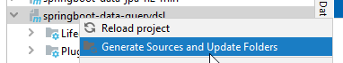
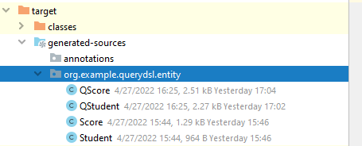

使用 querydsl-maven-plugin 从数据库生成 query dsl 的Entity和Q Class.

使用步骤 

 

如图: maven 卡片那块右键模块，选择 generate sources and update folders，之后querydsl-maven-plugin 会根据配置信息生成entity和Q class到指定的目录内。

 

querydsl-maven-plugin这个组件有点问题，在table表名是大写的驼峰命名时，生成的Q class里面的属性也是大写的驼峰命名。
如: `public static final QStudent Student = new QStudent("Student");`
然而com.infobip.spring.data.common.QuerydslExpressionFactory.getRelationalPathBaseFromQueryClass的方法会使用小写的驼峰命名法，
所以启动时会报Did not find a static field of the same type in xxx 这种错误。
```
    private RelationalPathBase<?> getRelationalPathBaseFromQueryClass(Class<?> queryClass) {
        String fieldName = CaseFormat.UPPER_CAMEL.to(CaseFormat.LOWER_CAMEL, queryClass.getSimpleName().substring(1));
        Field field = ReflectionUtils.findField(queryClass, fieldName);

        if (field == null) {
            throw new IllegalArgumentException("Did not find a static field of the same type in " + queryClass);
        }

        return (RelationalPathBase<?>) ReflectionUtils.getField(field, null);
    }
```

而当表名是全大写或者小写时，则运行正常。infobip-spring-data-jdbc-querydsl则推荐使用prosser，而不推荐使用querydsl-maven-plugin .

